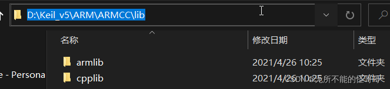
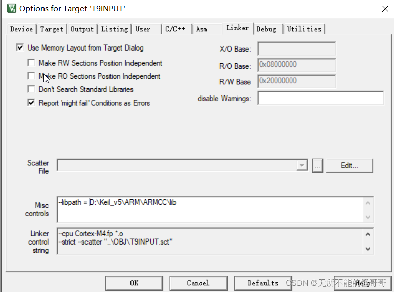

#【MDK(keil)编译错误】找不到main.o及解决方法、多处报错“未定义”

找不到main.o及解决方法
有时候当我们拿来别人的keil工程在自己的电脑上打开时会发生这样的错误，程序中已经有main函数，且确认没有写错，启动文件中也没有修改main标识，但是编译报错，并且程序中只有一个错误，就是找不到main.o标志，此时可能是别人的keil工程所包含的keil路径和自己的电脑上keil路径不同造成的，因为直接点击Project工程会默认按照上次打开时的配置进行打开（keil工程中有专门的文件记录工程中的配置等信息），可以尝试使用下面的解决方法

1. 首先找到keil的安装位置，依次打开下面的文件夹

Keil_v5\ARM\ARMCC\lib
然后点击路径，并复制该路径

2. 打开keil的魔法棒options for Target，选择Linker选项卡，把复制好的路径黏贴到Misc controls框中，替换掉原来的路径

3. 重新编译一下，检查是否能够通过编译

**这个问题在打开别人创建的keil工程的时候会经常出现，因为每个人安装keil的路径可能并不相同**，所以当学习会修改别人的工程时，如果遇到找不到main这种编译报错，就可以尝试通过这个方法解决。如果在使用keil打开别人的工程，遇到一些莫名其妙的问题，一定要去看看各种带有路径的设置，查看路径是否正确，很多莫名其妙的错误都是路径不同引起的。