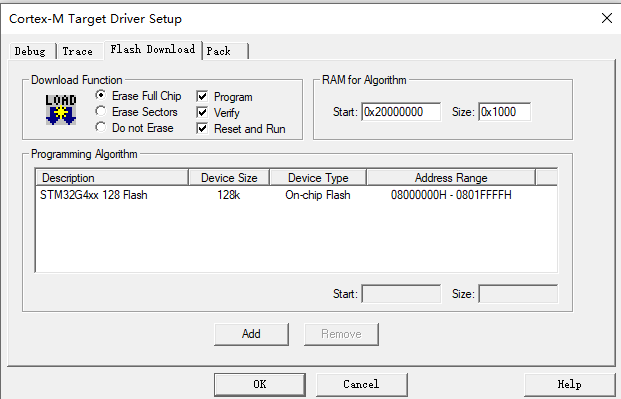
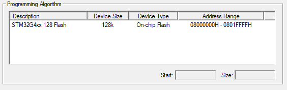

# 烧录器报错

- 常见原因
  - 驱动问题
  - 接线问题（数据线问题）
  - STlink等特殊烧录器需要接供电线
  - 编程算法

## 编程算法（Programming Algorithm）

这里下载程序实际上是把程序的二进制数据写入内部 Flash 上，这个过程与自己单片机程序里操作内部 Flash 是一样的，必须通过单片机提供的 Flash 外设接口（那些寄存器）来擦写。所以问题的核心点是 keil 如何去操作这些寄存器。以 ARM Cortex M为例，JTAG 和 SWD 可以通过 ARM 内核提供的 Debug 接口直接访问操作任意的地址，也就包括了所有外设的寄存器，因为这些寄存器都映射到地址上了。所以这就是一种可行的烧写方案。但这个方案有个致命的缺点，以 STM32 为例，每写几个字节到 Flash 上就要去操作一下寄存器，而 JTAG，SWD 协议的开销是很大的，所以会很慢很慢。那有什么办法呢？在 RAM 里开辟一个空间，通过调试器写一段很短的二进制程序进去，然后后面调试器就是与这段小程序通信了，批量传输一些数据到内存里，然后调用接口批量写入，速度就极快了。这段小程序的源代码 keil 自带了，在安装目录/ARM/FLASH/ 目录下，自己可以去定制他，甚至自己写一个算法让 Keil 支持下载到片外 Flash 比如 NAND 上，而且 Keil 不支持的芯片自己也可以加进去。基于 gcc 在 eclipse 上开发的话，这两个单词其实没有涉及到下载环节，真正的下载一般是下载器提供的接口，或者开源的 OpenOCD 干的。而 OpenOCD 也是内置了对应 Keil 的算法功能的代码，他称之为 Flash 驱动，常见的芯片他都内置了这些驱动，不需要再设置而已（不需要设置的原因是调试器可以读出芯片的型号，直接选择对应的驱动），要是碰到他没有内置驱动的芯片，他也是无能为力的。
>https://www.zhihu.com/question/393714823/answer/1215266675
