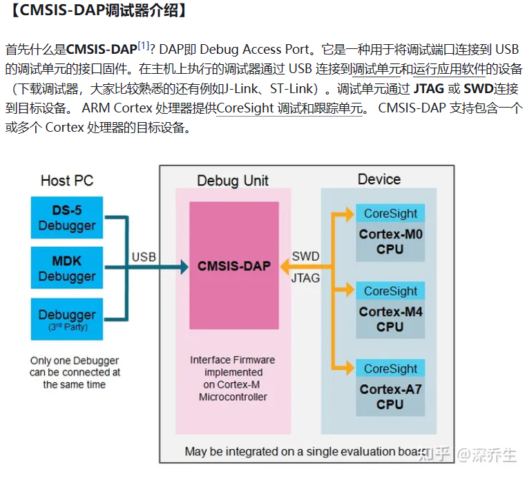
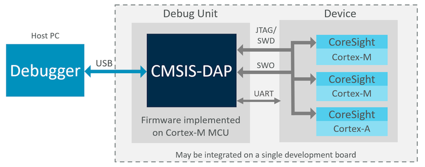

# 主流的调试器

1. J-link
2. ST-link
3. CMSIS-DAP Debugger

由于 J-link， ST-link非常熟悉，所以将对CMSIS-DAP进行详细的说明

## CMSIS-DAP Debugger

>[参考连接](https://zhuanlan.zhihu.com/p/378704446)

>[官方网站](https://developer.arm.com/documentation/101451/0100/About-CMSIS-DAP)

