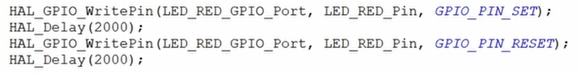
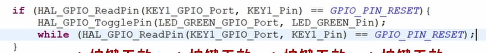
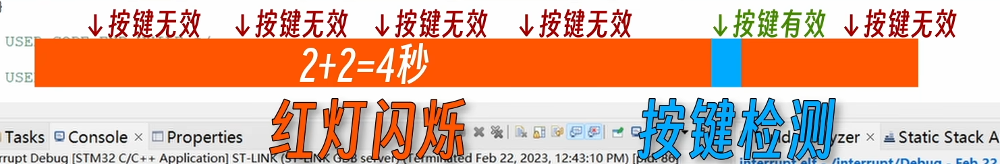

# 外部中断与回调函数

## 1 外部中断

在嵌入式领域外部中断往往是某些外设级，板载传感器触发，最典型的例子无非就是按键按下导致的GPIO引脚的电平变化。

### 1.1 中断存在的意义

我们不可能将程序一直在mian主循环中不停的执行而不掉头去处理其他的任务，假设没有中断的存在，程序在主循环进行的过程中也许无法即使的相应外设。

举例

---

现在有一个主循环一直执行小灯闪烁的进程，代码如下

又要进行按键检测

**那么他大概率将无法相应按键的检测**

因为当你按下按键的时候，大概率正在执行主循环程序，根本无法相应你的操作，你的才做只有当检测代码那一部分执行的时候才会触发，而这部分的时间非常短。

因此我们需要一个外部触发的中断，使按键按下的时候触发一个中断，然后跳入中断函数中处理任务和后续进程。

>[视频讲解](https://www.bilibili.com/video/BV1Fj411V7aq/?spm_id_from=333.999.0.0&vd_source=a3783e84d880b6ffb4a798de09eea520)
