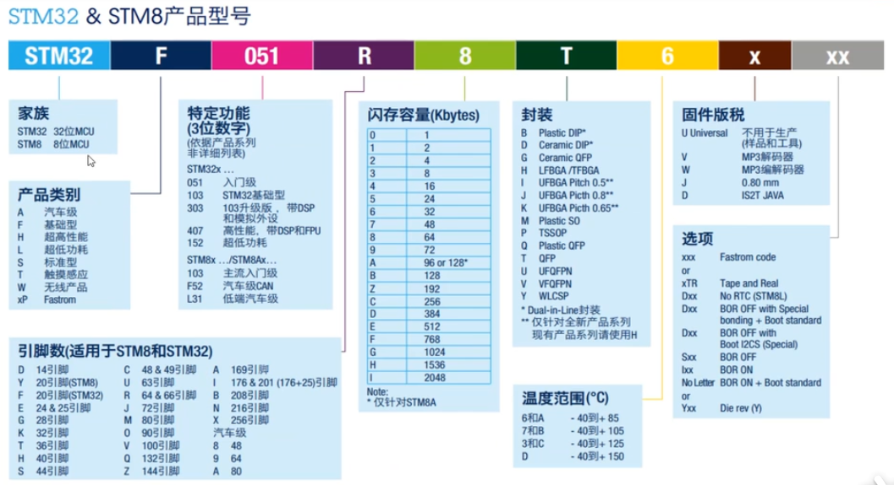
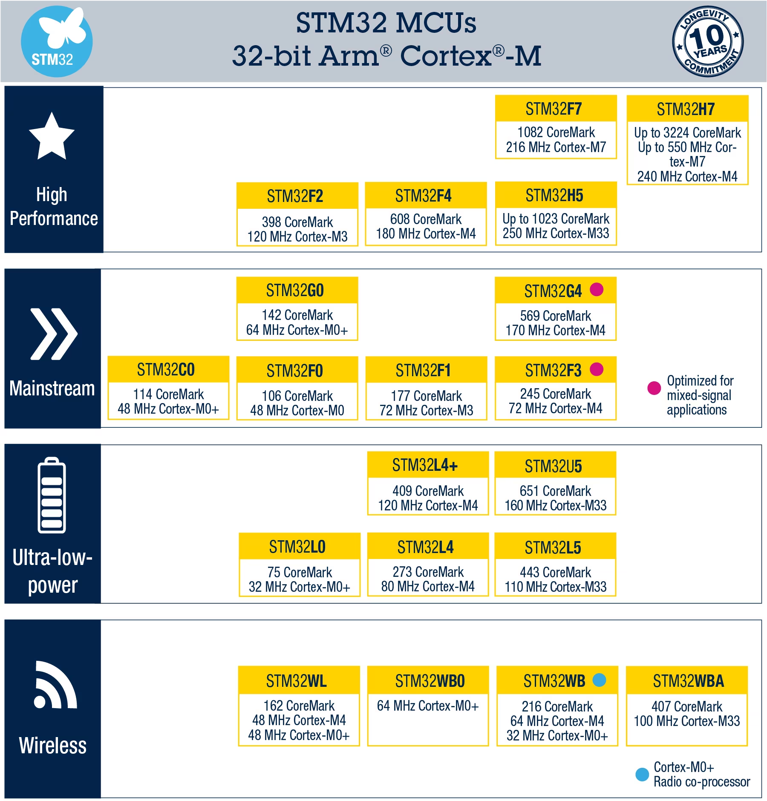
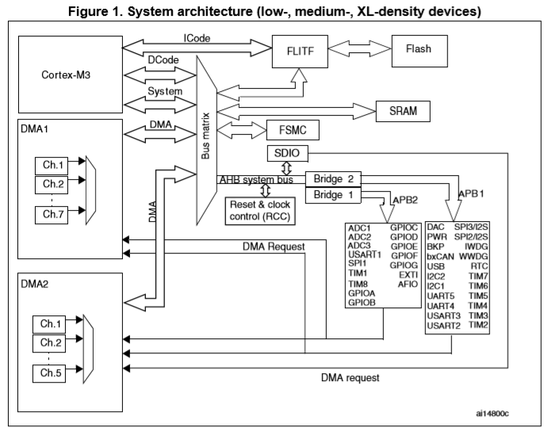

# STM32结构框图

## 0 STM32家族

## 1 STM32系统框图

### 1.1 Cortex-M3内核

它是STM32F103的内核，也就是CPU，相当于元帅。除掉他，其他部件都是片上外设，注意是片上的，也就是那块我们肉眼所见的芯片里的外设。这位元帅足不出户，便可操纵队列，依靠的是自己强大的数字运算能力和强大的总线设计。在阵列中，数据的运算都呈报给元帅来做。

### 1.2 Incode总线

阵列的运行需要有人下达指令，元帅Cortex-M3是命令的下发者，却并非命令的产生者。那么命令从何而来？在《三体》中，冯诺依曼在布阵前早已想好了指令。同样，各位STM32的热爱者才是聪慧的命令发起者——我们写好的程序被译成机器指令存储于Flash中。ICode总线就是一队骑兵，将指令一条条送达给元帅Cortex-M3。

### 1.3 Bus-Matrix

Bus-Matrix（总线矩阵）的功能是总线仲裁。类似于现在的快递站，假如没有快递站作为中转，一家快递公司的送货路线规划就变成了14亿条。在阵列中，方阵Bus-Matrix作为中介，减少了骑兵队的数量开销，增加了系统的简洁有序性，降低了信息传输的错误率。在图中，Bus-Matrix右侧安排了四支骑兵，他们送来的信息都被加以分类，而左侧的四支骑兵则可以从属于自己的类别中拿走信件，避免了错拿的情况。这就是Bus-Matrix的作用之处。

### 1.4 DCode总线

人如其名，骑兵队DCode被用来传送数据，这里的数据指程序中的常量和变量。常量存储在Flash，变量和堆栈则存储在SRAM。元帅Cortex-M3需要这些数据来作运算，中途还会让骑兵队DCode送些数据回去存储。

### 1.5 System总线

这个总线是被用来配置和访问片上外设寄存器的。元帅Cortex-M3要调度众多的外设方阵，所以专门设立了这样一支骑兵队。我们常说配啥啥寄存器，其实就是间接在给骑兵队System发号施令呢！

### 1.6 DMA总线

前面提到的三个骑兵队都通向元帅的大营，Cortex-M喜欢用他们送来的数据做运算。但如果要有很多骑兵前来告诉他这份数据要送到某某处，那他会心力交瘁的，DMA的设立则缓解了元帅的这个压力。STM32F103共有12个DMA通道，也就是12支机动部队，它们活动的路线并非像前三支骑兵队一样固定。在图中可以看到，外设方阵可以向机动部队发送请求，DMA搬运数据时也不会去打扰元帅，这样的部队真是元帅的得力助手啊。而且DMA可以轻轻松松搬运大批量的数据，从不会耐烦，堪称数据的搬运工。

### 1.7 FLASH

冯诺依曼是个聪明人，早知道阵列模拟不会一次性成功。为了不用自己一次次重新颁布指令，就安排了名为Flash的将军来记载指令和常量。Flash将军是军中记忆力最好的(我们知道程序下载到Flash里后是掉电不失去的)。

### 1.8 SRAM

RAM可分为静态存储器（Static Random Access Memory,SRAM）和动态存储器（Dynamic Random Access Memory）。SRAM中的存储单元相当于一个锁存器，只有0，1两个稳态；DRAM则是利用电容存储电荷来保存0和1两种状态，因此需要定时对其进行刷新，否则随着时间的推移，电容其中存储的电荷将逐渐消失。

变量和堆栈记录，为啥不能交给Flash一并做呢？这是因为Flash将军虽然记忆好，但是手脚慢，而变量更改比较频繁，让他干这个不合适。代替他的就是SRAM方阵(我们都知道SRAM是掉电丢失的，但是数据读写真的很快)。