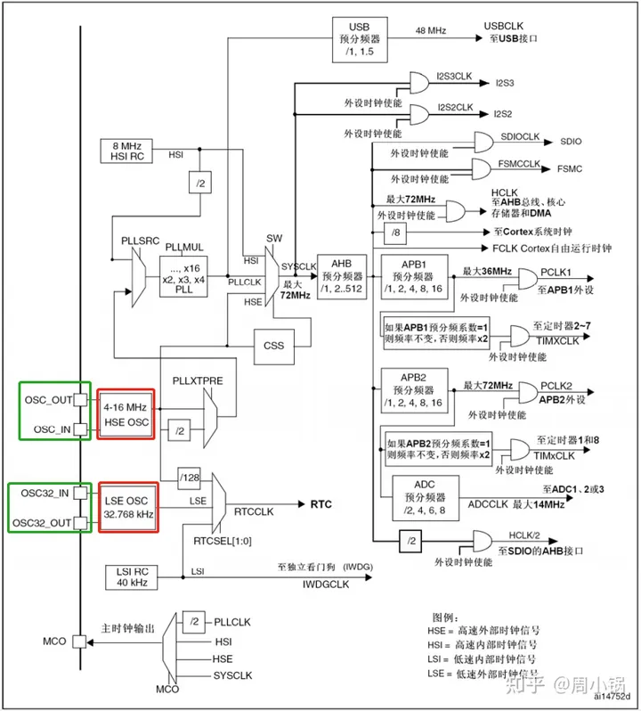
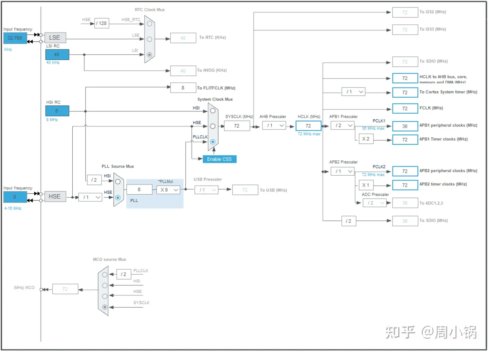
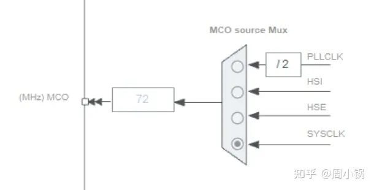
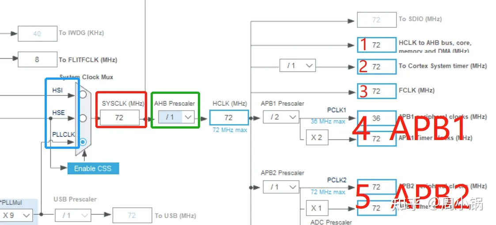
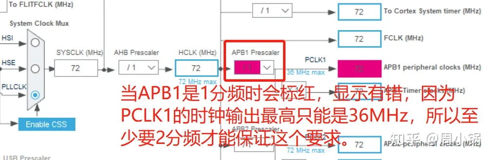
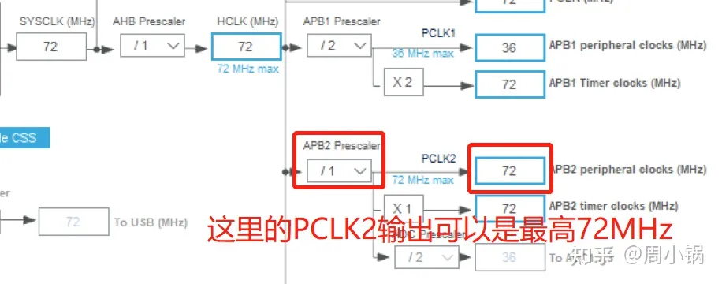

## 一、基本概念：

+   RCC： Reset and Clock Control，即复位和时钟控制。
+   HSE： High Speed External Clock signal，高速外部时钟信号，即是OSC\_IN和OSC\_OUT接口所接的4~16MHz的晶振，一般接8MHz。
+   LSE： Low Speed External Clock signal，低速外部时钟信号，即是OSC32\_IN和OSC32\_OUT接口，指外部用于RTC的32.768KHz晶振。
+   HSI： High Speed Internal Clock signal，高速内部时钟信号，出厂校准的8MHz内部RC振荡器。
+   LSI： Low Speed Internal Clock signal，高速内部时钟信号，带有校准功能的40KHz的内部RC振荡器。
+   RTC： Real Time Clock实时时钟，用于带有年、月、日、小时、分钟、秒钟的计时器。
+   PLL：锁相环倍频输出，其时钟输入源可选择为HSI/2、HSE或者HSE/2。倍频可选择为2~16倍，但是其输出频率最大不得超过72MHz。
+   SYSCLK：系统时钟，最高72MHz。
+   AHB：高级高性能总线，这是一种“系统总线”AHB主要用于高性能模块(如CPU、DMA和DSP等)之间的连接。AHB 系统由主模块、从模块和基础结构(Infrastructure)3部分组成，整个AHB总线上的传输都由主模块发出，由从模块负责回应。
+   APB：是一种外围总线。APB主要用于低带宽的周边外设之间的连接，例如UART等，它的总线架构不像 AHB支持多个主模块，在APB里面唯一的主模块就是APB 桥。


---

<!-- @import "[TOC]" {cmd="toc" depthFrom=1 depthTo=6 orderedList=false} -->

<!-- code_chunk_output -->

- [一、基本概念：](#一-基本概念)
- [二、外部晶振与内部晶振的区别：](#二-外部晶振与内部晶振的区别)
- [三、时钟树](#三-时钟树)
- [四、时钟输出的5大模块](#四-时钟输出的5大模块)
- [五、设计到的寄存器与库函数](#五-设计到的寄存器与库函数)
  - [**1.标准库手册中提到的RCC寄存器：**](#1标准库手册中提到的rcc寄存器)
  - [**2.标准库手册中的RCC库函数：**](#2标准库手册中的rcc库函数)
  - [**3.程序编写流程：**](#3程序编写流程)
  - [**4.按照上述流程编写代码：**](#4按照上述流程编写代码)

<!-- /code_chunk_output -->

---

## 二、外部晶振与内部晶振的区别：

外部晶振比较稳定而内部晶振的误差比较大，但如果对频率要求不高，如不涉及到串口通信和精确定时等情况时，则可以使用内部晶振。所以如果对频率要求不高，则一般是优先使用内部晶振。如果要省电，用到了SLEEP，则不能使用内部晶振，因为内部振荡会停止。

## 三、时钟树 



图1.STM32中文参考手册的时钟树



图2.STM32CubeMX软件上的时钟树

STM32中有一个全速功能的USB模块，其串行接口引擎需要一个频率为48MHz的时钟源。该时钟源只能从PLL输出端获取，可以选择为1.5分频或者1分频，也就是当需要使用USB模块时，PLL必须使能，并且时钟频率配置为48MHz或72MHz。

STM32还可以选择一个时钟信号输出到MCO脚(PA8)上，可以选择为PLL输出的2分频、HSI、HSE、或者系统时钟。



图3.MCO脚的时钟

**注意：**

+   当HSI作为PLL时钟的输入时，系统时钟频率最高只能达到64MHz；
+   当使用USB功能时，必须同时使用HSE和PLL，CPU的频率必须是48MHz或者72MHz；
+   当需要ADC采样时间为1us时，APB2必须设置在14MHz、28MHz、56MHz。

## 四、时钟输出的5大模块

SYSCLK系统时钟可选择为PLL输出、HSI或者HSE，系统时钟最大频率为72MHz，它通过AHB分频器分频后送给各模块使用，AHB分频器可选择1、2、4、8、16、64、128、256、512分频。其中AHB分频器输出的时钟送给**5大模块**使用，如下图所示：



图4.五大模块

+   1.经有HCLK送给AHB总线、内核、存储器和DMA。
+   2.通过8分频后送给Cortex的系统时钟。
+   3.直接送给Cortex的自由运行时钟FCLK。
+   4.其中一个模块是送给APB1分频器模块。APB1分频器可选择1、2、4、8、16分频，其输出一路供APB1外设使用(PCLK1，最大频率36MHz)，另一路送给定时器(Timer)2、3、4倍频器使用。该倍频器可选择1或者2倍频，时钟输出供定时器2、3、4使用。APB1设置为1分频时会出现如下图所示的情况：



图5.低速外设APB1分频器模块

+   5.还有一路是2送给APB2分频器模块。APB2分频器可选择1、2、4、8、16分频，其输出一路供APB2外设使用(PCLK2，最大频率72MHz)，另一路送给定时器(Timer)1倍频器使用。该倍频器可选择1或者2倍频，时钟输出供定时器1使用。另外，APB2分频器还有一路输出供ADC分频器使用，分频后送给ADC模块使用。ADC分频器可选择为2、4、6、8分频。



图6.高速外设APB2分频器模块

在以上的时钟输出中，有很多是带使能控制的，例如AHB总线时钟、内核时钟、各种APB1外设、APB2外设等等。**当需要使用某模块时，记得一定要先使能对应的时钟。其中两个重要的外设接口APB1与APB2有如下用途：**

+   连接在APB1(低速外设)上的设备有：电源接口、备份接口、CAN、USB、I2C1、I2C2、UART2、UART3、SPI2、窗口看门狗、Timer2、Timer3、Timer4。注意USB模块虽然需要一个单独的48MHz时钟信号，但它应该不是供USB模块工作的时钟，而只是提供给串行接口引擎(SIE)使用的时钟。USB模块工作的时钟应该是由APB1提供的。即： APB1负责DA，USB，SPI，I2C，CAN，串口2345，普通TIM等设备。
+   连接在APB2(高速外设)上的设备有：UART1、SPI1、Timer1、ADC1、ADC2、所有普通IO口(PA~PE)、第二功能IO口。即 APB2负责AD，I/O，高级TIM，串口1等设备。

***外设指的是单片机外部的外围功能模块，比如键盘控制芯片，液晶，A/D转换芯片，等等。外设可通过单片机的I/O，SPI，I2C等总线控制。 常见stm32外设：基本IO、定时器TIM、串口USART、ADC模数转换、DAC数模转换、SPI串行通信、EXIT外部中断、BKP备份数据、RTC闹钟SysTick系统滴答、WDG看门狗（独立+窗口）、DMA传输数据、片内FLASH编程、FSMC读写外部SRAM、外部NorFlash操作等。***

## 五、设计到的寄存器与库函数

### **1.标准库手册中提到的RCC寄存器：**


### **2.标准库手册中的RCC库函数：**


### **3.程序编写流程：**

1.  使能HSE(RCC\_HSEConfig)
2.  等待HSE稳定(RCC\_WaitForHSEStartUp)
3.  HSE稳定后使能预取指(FLASH\_PrefetchBufferCmd)
4.  设置FLASH等待(FLASH\_SetLatency)
5.  设置三总线分频因子(RCC\_HCLKConfig、RCC\_PCLK1Config、RCC\_PCLK2Config)
6.  设置PLL锁相环的时钟源和倍频因子(RCC\_PLLConfig)
7.  使能PLL
8.  等待PLL稳定 while( RCC\_GetFlagStatus(RCC\_FLAG\_PLLRDY)== RESET )
9.  选择系统时钟(RCC\_SYSCLKConfig)
10.  等待系统时钟稳定while( RCC\_GetSYSCLKSource() != 0x08 )；

### **4.按照上述流程编写代码：**

```c
#include "clkconfig.h"
void HSEConfig(uint32_t RCC_PLLMul_x)    //RCC_Configuration函数名是自己定义的，不能在库函数中找到。
{
    ErrorStatus HSEStatus;
    
    //将RCC寄存器复位为复位值
    RCC_DeInit();
    
    //使能HSE
    RCC_HSEConfig( RCC_HSE_ON );
    
    HSEStatus = RCC_WaitForHSEStartUp();
    
    if( HSEStatus == SUCCESS )
    {
        //使能预取指
        FLASH_PrefetchBufferCmd( FLASH_PrefetchBuffer_Enable );
        //设置等待
        FLASH_SetLatency( FLASH_Latency_2 );
        
        //配置三总线分频因子
        RCC_HCLKConfig( RCC_SYSCLK_Div1 );
        RCC_PCLK1Config( RCC_HCLK_Div2 );
        RCC_PCLK2Config( RCC_HCLK_Div1 );
        
        //配置PLL的时钟源和倍频因子
        RCC_PLLConfig( RCC_PLLSource_HSE_Div1, RCC_PLLMul_x );
        
        //使能PLL
        RCC_PLLCmd(ENABLE);
        
        //等待PLL稳定
        while( RCC_GetFlagStatus( RCC_FLAG_PLLRDY ) == RESET );
        
        //选择系统时钟
        RCC_SYSCLKConfig( RCC_SYSCLKSource_PLLCLK );
        
        //等待系统时钟稳定
        while( RCC_GetSYSCLKSource() != 0x08 );
    }
    else
    {
        /* HSE启动失败 */
    }
}
```

**或者：**

```c
void RCC_Configuration(void){ //RCC时钟的设置，该函数名由自己命名。
    ErrorStatus HSEStartUpStatus;   
    RCC_DeInit();              /* RCC system reset(for debug purpose) RCC寄存器恢复初始化值*/   
    RCC_HSEConfig(RCC_HSE_ON); /* Enable HSE 使能外部高速晶振*/   
    HSEStartUpStatus = RCC_WaitForHSEStartUp(); /* Wait till HSE is ready 等待外部高速晶振使能完成*/   
    if(HSEStartUpStatus == SUCCESS){   
        /*设置PLL时钟源及倍频系数*/   
        RCC_PLLConfig(RCC_PLLSource_HSE_Div1, RCC_PLLMul_9); //RCC_PLLMul_x（枚举2~16）是倍频值。当HSE=8MHZ,RCC_PLLMul_9时PLLCLK=72MHZ   
        /*设置AHB时钟（HCLK）*/   
        RCC_HCLKConfig(RCC_SYSCLK_Div1); //RCC_SYSCLK_Div1——AHB时钟 = 系统时钟(SYSCLK) = 72MHZ（外部晶振8HMZ）   
        /*注意此处的设置，如果使用SYSTICK做延时程序，此时SYSTICK(Cortex System timer)=HCLK/8=9MHZ*/   
        RCC_PCLK1Config(RCC_HCLK_Div2); //设置低速AHB时钟（PCLK1）,RCC_HCLK_Div2——APB1时钟 = HCLK/2 = 36MHZ（外部晶振8HMZ）   
        RCC_PCLK2Config(RCC_HCLK_Div1); //设置高速AHB时钟（PCLK2）,RCC_HCLK_Div1——APB2时钟 = HCLK = 72MHZ（外部晶振8HMZ）   
        /*注：AHB主要负责外部存储器时钟。APB2负责AD，I/O，高级TIM，串口1。APB1负责DA，USB，SPI，I2C，CAN，串口2，3，4，5，普通TIM */  
        FLASH_SetLatency(FLASH_Latency_2); //设置FLASH存储器延时时钟周期数   
        /*FLASH时序延迟几个周期，等待总线同步操作。   
        推荐按照单片机系统运行频率：
        0—24MHz时，取Latency_0；   
        24—48MHz时，取Latency_1；   
        48~72MHz时，取Latency_2*/   
        FLASH_PrefetchBufferCmd(FLASH_PrefetchBuffer_Enable); //选择FLASH预取指缓存的模式，预取指缓存使能   
        RCC_PLLCmd(ENABLE);    //使能PLL
        while(RCC_GetFlagStatus(RCC_FLAG_PLLRDY) == RESET); //等待PLL输出稳定   
        RCC_SYSCLKConfig(RCC_SYSCLKSource_PLLCLK); //选择SYSCLK时钟源为PLL
        while(RCC_GetSYSCLKSource() != 0x08); //等待PLL成为SYSCLK时钟源   
    }
    /*开始使能程序中需要使用的外设时钟*/ 
    /*在设置一个外设前，必须调用以下一个函数来使能它的时钟*/  
//    RCC_APB2PeriphClockCmd(RCC_APB2Periph_USART1 | RCC_APB2Periph_GPIOA | RCC_APB2Periph_GPIOB |   
//    RCC_APB2Periph_GPIOC | RCC_APB2Periph_GPIOD | RCC_APB2Periph_GPIOE, ENABLE); //APB2外设时钟使能      
//    RCC_APB1PeriphClockCmd(RCC_APB1Periph_USART2, ENABLE); //APB1外设时钟使能  
//    RCC_APB1PeriphClockCmd(RCC_APB1Periph_USART3, ENABLE);   
//    RCC_APB2PeriphClockCmd(RCC_APB2Periph_SPI1, ENABLE);        
//    RCC_APB2PeriphClockCmd(RCC_APB2Periph_AFIO, ENABLE);    
}  
```