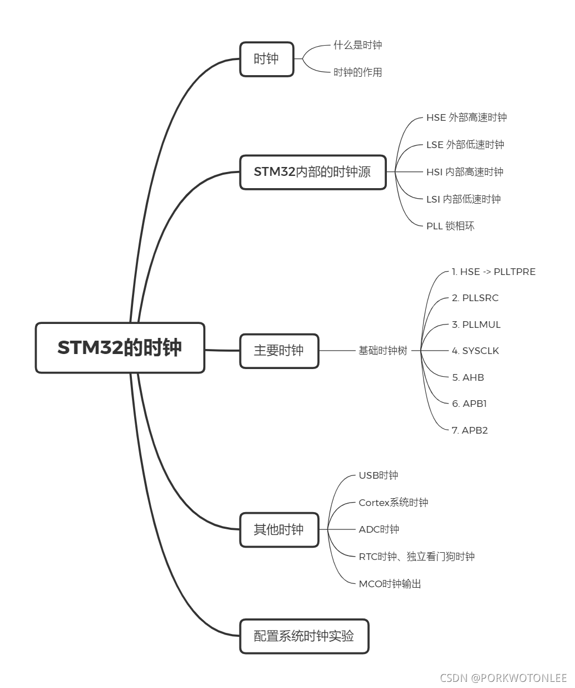
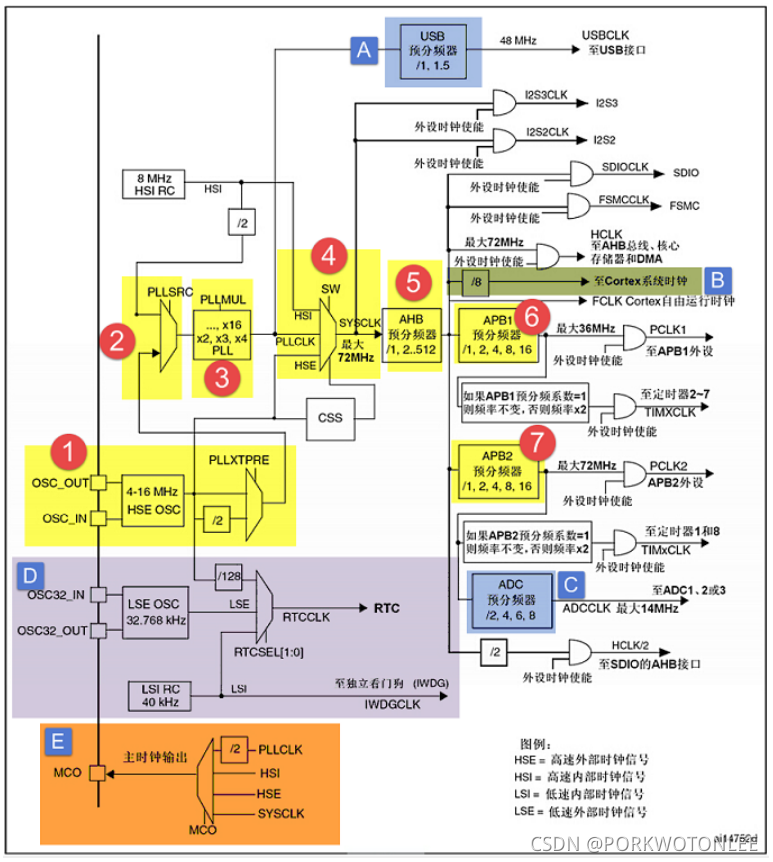

#### 目录

- [基本知识框架](#基本知识框架)
- [课堂笔记](#课堂笔记)
  - [时钟](#时钟)
    - [什么是时钟？时钟有什么作用](#什么是时钟时钟有什么作用)
  - [时钟源](#时钟源)
    - [HSE 外部高速时钟](#hse-外部高速时钟)
    - [HSI 内部高速时钟](#hsi-内部高速时钟)
    - [LSE 外部低速时钟](#lse-外部低速时钟)
    - [LSI 内部低速时钟](#lsi-内部低速时钟)
    - [PLL锁相环](#pll锁相环)
  - [主要时钟和其他时钟](#主要时钟和其他时钟)
    - [主要时钟](#主要时钟)
    - [其他时钟](#其他时钟)
  - [配置系统时钟实验](#配置系统时钟实验)
- [基本知识框架Xmind文件下载](#基本知识框架xmind文件下载)

## 基本知识框架



## 课堂笔记

### 时钟

#### 什么是时钟？时钟有什么作用

时钟是STM32内部最核心的器件，它可以提供时钟信号。依赖于这个信号，STM32中的器件才可以有条不紊地将工作进行下去。正如人的脉搏一般

> 时钟的作用  
> **同步状态**：时序逻辑电路，是讲求顺序的，通过统一一致的时钟信号，元器件才能知道自己处于什么状态，是该工作还是待机，互相协同将任务完成  
> **降低功耗**：时钟频率越高的设备，往往功率都越高。一个设备所有的外设不可能都用同一个时钟信号，对于不同的外设，配置不同的时钟信号可以有效地降低功耗，有的外设甚至可以关闭时钟信号

### 时钟源

STM32中能够主动发出时钟信号的元器件，可以用作**时钟源**。STM32中有四个时钟源，还有一个辅助时钟源生成倍频时钟信号的器件锁相环

#### HSE 外部高速时钟

时钟信号由外部晶振提供，时钟频率一般在**4-16MHz**，是经常会用到的时钟源

> 这里的外部晶振可以是有源晶振，也可以是无源晶振，它们的区别在于与STM32的 连接方式，以及需不需要谐振电容

#### HSI 内部高速时钟

时钟信号由内部RC震荡电路提供，时钟频率为**8MHz**，但是这个时钟频率会随着温度产生漂移，很不稳定，所以一般不使用此时钟信号

#### LSE 外部低速时钟

时钟信号由外部晶振提供，时钟频率一般为32.768KHz，这个信号一般用于RTC实时时钟

#### LSI 内部低速时钟

时钟信号由内部RC振荡电路提供，时钟频率一般为40KHz，这个信号一般用于独立看门狗时钟

#### PLL锁相环

PLL锁相环是辅助产生时钟信号的器件。将时钟信号输入锁相环，锁相环可以将这个时钟信号的频率按照指定倍率提高（倍频）之后，再输出

> 与锁相环具有相反作用的是分频器，分频器可以将输入时钟信号分率按照指定倍率降低之后，再输出

### 主要时钟和其他时钟

光知道时钟，是不行的。还需要理解时钟内部之间的联系，如何通过时钟源得到其他外设的时钟信号，时钟信号是如何转换传递的，通过对基础时钟树的分析，这些问题统统会有答案

以下是RCC的框图（RCC：Reset Clock Control 复位时钟控制），里面包含了主要时钟（1-7）和其他时钟（A-E）  


#### 主要时钟

单独分析和了解时钟的过程，是很枯燥的。结合某条特定时钟树去讲解时钟会更易于理解，也使得这个认知的过程更有趣  
**时钟树**是一个用于时钟信号传递的网状结构，通过时钟树，可以将时钟源的时钟信号传递到所需要的外设处。现在通过最基础的时钟树（路径如上图中1-6）去验证之前的解析，基础时钟树的最终目标是配置好系统时钟SYSCLK（72MHz）以及外设时钟PCLK1（32MHz），PCLK2（72MHz）

+   **1.HSE 与 PLLXTPRE**

> HSE是外部高速时钟，时钟信号由外部晶振提供。HSE时钟信号将会传递给PLLXTPRE，这个过程可以选择将HSE时钟信号进行1分频（不分频）或者2分频处理，之后PLLXTPRE会将选择的时钟信号再传递给PLLSRC。基础时钟树中，HSE提供最常用的8MHz时钟信号，传递到PLLXTPRE的时钟信号选择1分频，依旧是8MHz

+   **2.PLLSRC**

> PLLSRC的输入时钟信号可以选择PLLXTPRE（其实也就是HSE）或者是进行2分频后的HSI时钟信号。由于HSI的时钟信号容易漂移，基础时钟树中，输入时钟信号选择HSE，输出时钟信号直接传递给PLLMUL

+   **3.PLLMUL / PLLCLK**

> PLLMUL其实就是PLL锁相环，可以对时钟信号进行倍频处理，倍频后得到的信号就是PLL时钟信号PLLCLK，基础时钟树中选择8倍频输出，也就是倍频到8MHz\*9=72MHz后，输出PLLCLK时钟信号传递给系统时钟SYSCLK

+   **4.SYSCLK**

> 可以从图中看到，系统时钟SYSCLK可以有很多的输入时钟信号（通过Switcher进行选择），包括HSI，HSE或是PLLMULL。基础时钟树中，选择PLLCLK作为输入时钟信号，到这里，系统时钟SYSCLK就被配置为72MHz（最高频率），基础时钟树的任务完成了1/3，之后SYSCLK时钟信号会被传递给AHB预分频器

+   **5.AHB / HCLK**

> 系统时钟SYSCLK经过AHB分频器进行分频操作，得到总线时钟HCLK。基础时钟树中，经过AHB分频器1分频后，得到总线时钟HCLK，时钟频率依旧为72MHz，HCLK时钟信号会传递给APB1，APB2预分频器

+   **6.APB1 / PCLK1**

> 因为APB1总线上挂载的都是低速外设，所以HCLK时钟信号还经过APB1预分频器要进行2分频，得到低速外设时钟信号PCLK1，时钟频率为36MHz

+   **7.APB2 / PCLK2**

> 因为APB1总线上挂载的都是高速外设，所以HCLK时钟信号还经过APB2预分频器进行1分频后，得到高速外设时钟信号PCLK2，时钟频率为72MHz

至此，基础时钟树的任务圆满完成，STM32内核开始正常运行，同时外设总线上的外设也开始工作

#### 其他时钟

通过时钟树已经能对主要时钟以及主要时钟之间的联系有了一定的理解。主要时钟以外的其他时钟，较为重要的，可以一一列举出来讲解：

+   **A.USB时钟**

> USB时钟信号是通过PLLCLK时钟信号经过USB预分频器得到，分频因数可以是1或者1.5，USB时钟信号的频率为48MHz，这就意味着PLLCLK时钟信号的频率只能48MHz或者72MHz。由于USB时钟信号对频率的要求较高，所以只能由HSE经过PLL倍频后时钟信号提供，不能由HSI提供

+   **B.Cortex系统时钟**

> Cortex系统时钟信号由HCLK时钟信号经过8分频处理后得到，也就是72MHz / 8 = 9MHz，这个时钟信号提供给系统内核SysTick定时器，SysTick定时器一般用于操作系统的时钟节拍，也可以用于普通定时器

+   **C. ADC时钟**

> ADC时钟信号是由PCLK2时钟信号经过ADC预分频器处理后的得到，分频因数可以是2，4，6，8。ADC时钟信号频率最高为14MHz，反推PCLK2时钟信号的频率只能是28MHz，56MHz，因为PCLK2时钟信号的频率最高为72MHz

+   **D.RTC时钟 / 独立看门狗时钟**

> RTC时钟信号可以由HSE或者HSI提供（HSE提供RTC时钟信号的话需要经过128分频处理），也可以由LSE时钟信号提供，时钟频率为32.768KHz。而独立看门狗时钟信号只能由LSI提供，LSI时钟信号是内部低速时钟信号，频率在30~60KHz之间不等，一般取40KHz

+   **E.MCO时钟输出**

> MCO（MicroController Clock Output微控制器时钟输出）时钟输出，可以在STM32 F1的PA8引脚，通过复用，对外输出时钟信号，作为一个有源晶振来使用，对外输出的时钟信号可以来自PLLCLK/2、HSI、HSE或者SYSCLK。此外通过输出的时钟信号，来观察与判断内部时钟是否配置正确

### 配置系统时钟实验

在介绍时钟信号传递流程时，硬件上通过时钟树进行描述；软件上通过启动文件中的SystemInit()函数进行配置，SystemInit函数的定义在system\_stm32f10x.c中。通过修改此文件相关内容，可以修改系统时钟，但为了保持库文件的完整性，一般不去做这样的修改，而是另外通过自定义函数来实现

自定义的RCC系统时钟配置函数流程大致为

1.  定义晶振结构体，时钟结构体
2.  初始化晶振结构体，选择HSE，并设置分频因子
3.  设置PLL
4.  等待晶振初始化
5.  初始化时钟结构体，设置SYSCLK，HCLK，PCLK1，PCLK2
6.  等待时钟初始化完成

时钟驱动文件共有两个，bsp\_clkconfig.h和bsp\_clkconfig.c  
bsp\_clkconfig.c代码主体部分实现

```c
/*
 * bsp_clkconfig.c
 *
 *  Created on: 2021年10月17日
 *      Author: 67566
 */

#ifndef BSP_CLKCONFIG_C_
#define BSP_CLKCONFIG_C_

#include "bsp_clkconfig.h"

extern void Error_Handler(void);

void HSE_SetSysClock(void)
{
	// Define RCC OscInitTypeDef & ClkInitTypeDef Structure
	RCC_OscInitTypeDef RCC_OscInitStruct = {0};
	RCC_ClkInitTypeDef RCC_ClkInitStruct = {0};

	// Enabled HSE & PLL
	RCC_OscInitStruct.OscillatorType = RCC_OSCILLATORTYPE_HSE;
	RCC_OscInitStruct.HSEState       = RCC_HSE_ON;
	RCC_OscInitStruct.HSEPredivValue = RCC_HSE_PREDIV_DIV1;
	RCC_OscInitStruct.PLL.PLLState   = RCC_PLL_ON;

	// Ensure HSE Work Properly
	if (HAL_OK != HAL_RCC_OscConfig(&RCC_OscInitStruct))
	{
		// Enable Clock
		RCC_ClkInitStruct.ClockType      = RCC_CLOCKTYPE_SYSCLK |
									  	   RCC_CLOCKTYPE_HCLK |
										   RCC_CLOCKTYPE_PCLK1 |
										   RCC_CLOCKTYPE_PCLK2;
		RCC_ClkInitStruct.SYSCLKSource   = RCC_SYSCLKSOURCE_HSE;
		RCC_ClkInitStruct.AHBCLKDivider  = RCC_SYSCLK_DIV1;
		RCC_ClkInitStruct.APB1CLKDivider = RCC_HCLK_DIV2;
		RCC_ClkInitStruct.APB2CLKDivider = RCC_HCLK_DIV16;
	}
	// // Ensure Clock Work Properly
	if (HAL_OK != HAL_RCC_ClockConfig(&RCC_ClkInitStruct, FLASH_LATENCY_0))
	{
		Error_Handler();
	}
}

void Delay(long long count)
{
	for (; count<0; count--)
	{}
}

#endif /* BSP_CLKCONFIG_C_ */
```

## 基本知识框架Xmind文件下载

链接：[资源下载](https://download.csdn.net/download/PORKWOTONLEE/33288150)