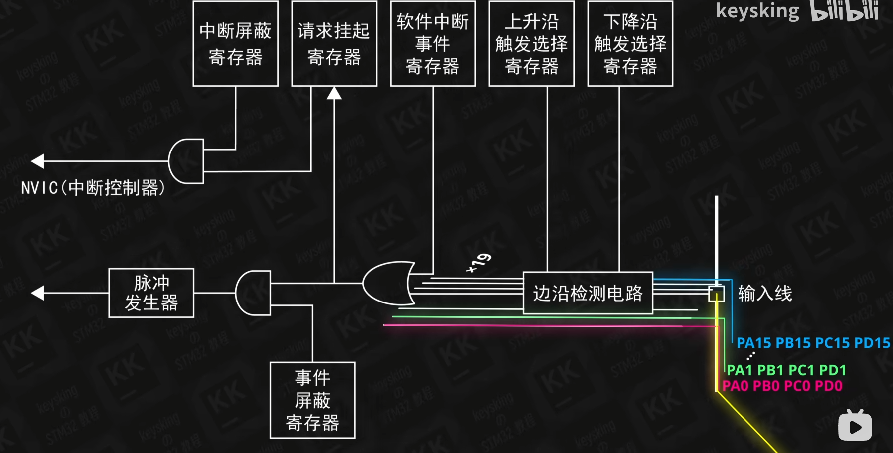
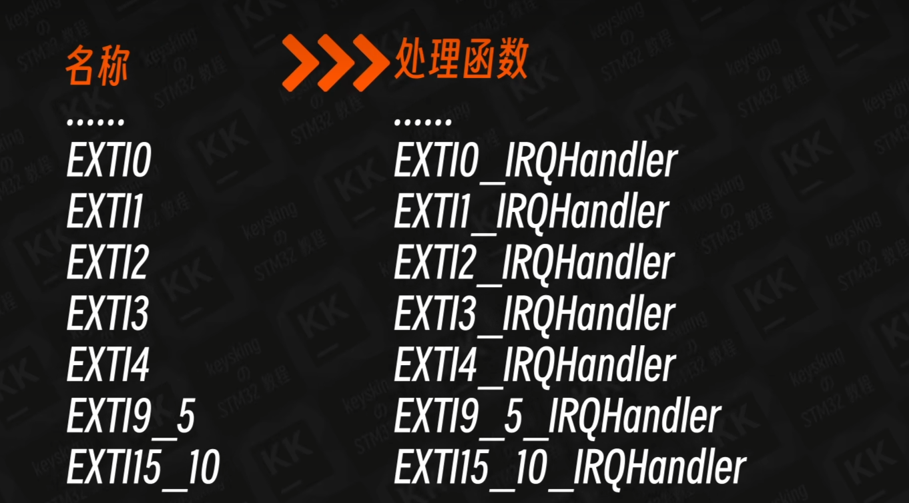
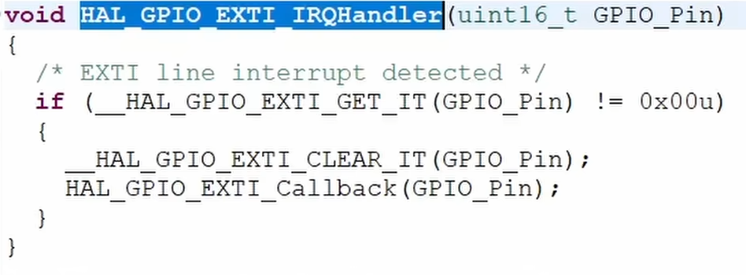
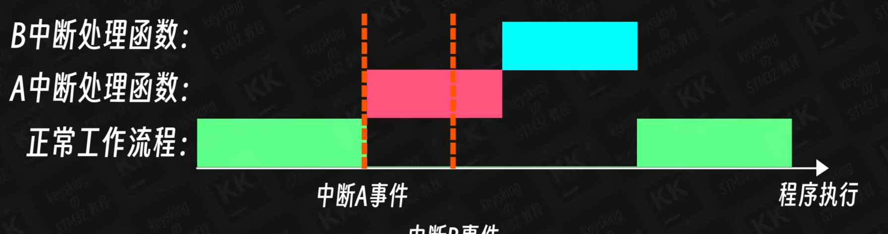
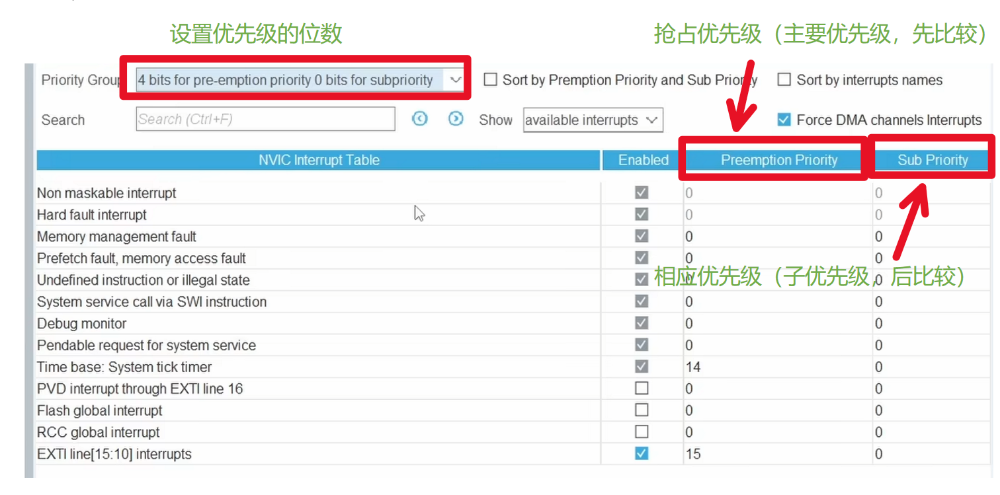

# 中断及其结构

## 1 外部中断

当外部中断触发时，信号将会道道`外部中断/事件控制器`,外部中断公用一台寄存器（分别于GPIO引脚对应），但是连线时独立的，如下图所示：

`外部中断/事件控制器`：

经过`外部中断/事件控制器`，信号将会继续出发，达到最核心的**NVIC**即`嵌套向量中断控制器`。

需要注意的是，外部中断将会轮询查询是否触发，所以假设按键按下，IRQHanderler被激活，执行任务，若松开不动将又会激活，所以需要清除**请求挂起寄存器**，这部分HAL库的`HAL GPIO EXTI IRQHandler(KEYl Pin);`已经帮我们自动做完了（__HAL_GPIO_EXTI_CLEAR_IT(GPIO_Pin);）
。

## 2 优先级问题

- 优先级
  - 抢占优先级
  - 相应优先级

### 2.1 比较优先级的情况

#### 2.1.1 中断同时发生

两中断同时发生时，先比较抢占优先级。
若抢占优先级相同，再比较响应优先级。
响应优先级也相同，比较向量表中的顺序。

#### 2.1.2 一个中断执行中

一个中断正在执行中，只需要比较两者的抢占优先级

## 3 优先级在cubemx中的设置

