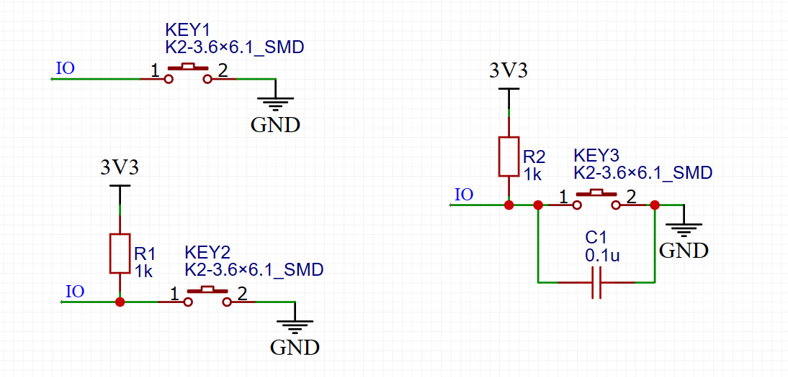
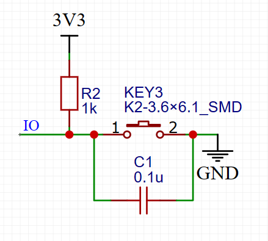
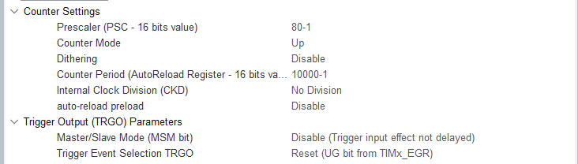
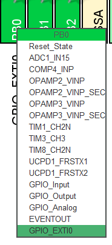
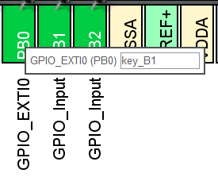
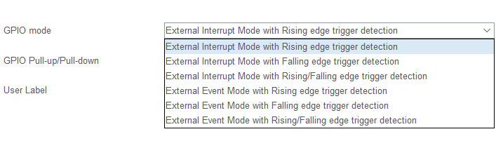
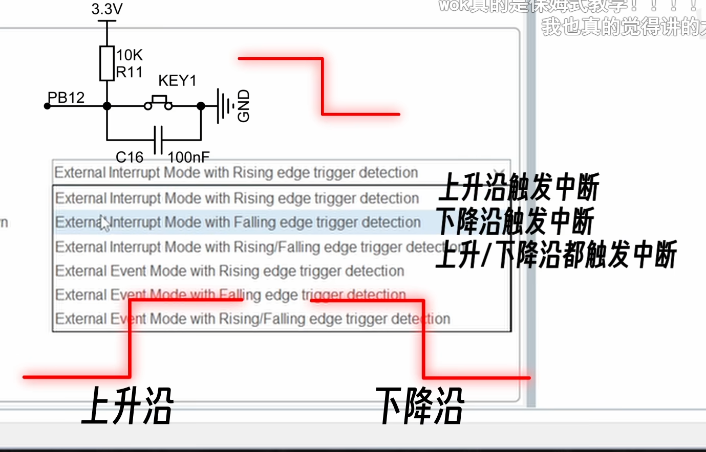

# 按键检测

<!-- @import "[TOC]" {cmd="toc" depthFrom=1 depthTo=6 orderedList=false} -->

<!-- code_chunk_output -->

- [按键检测](#按键检测)
  - [1 硬件/GPIO配置](#1-硬件gpio配置)
  - [2 软件检测按键](#2-软件检测按键)
    - [2.1 轮询检测](#21-轮询检测)
    - [2.2 外部中断](#22-外部中断)
      - [2.2.1 中断处理函数](#221-中断处理函数)
  - [3 软件消抖](#3-软件消抖)

<!-- /code_chunk_output -->


## 1 硬件/GPIO配置



- 按键硬件设计
  1. 直接与GND相连
  2. 上拉电阻
  3. 外加旁路电容

**不同的硬件连接对应不同的软件编写**

- 软件配置
  1. 直接与GND相连：需要内部上拉模式
  2. 上拉电阻：内部为浮空输入，高阻态此时上拉电阻分压极少，电平直接打在IO口
  3. 外加旁路电容：增加了硬件消抖（机械按键按下的几个毫秒内差生震动，电平不稳定，对于单片机将难以判断）

  结合软件和硬件的配置我们常见的硬件配置如下：

---

硬件：


软件：
浮空输入模式，软件消抖

---


## 2 软件检测按键

### 2.1 轮询检测

由于CPU并不知道何时会按下按键，所以我们需要不停的轮询按键状态，检测是否按下
考虑到节省CPU资源，我们并不会放在主循环中高速轮询，往往只需要挂载在一个周期性触发的回调函数的某一个基本定时器即可，定时器的计数周期可以开到10ms以节省资源

以tim3为例，主频80MHz，分频得到1MHz（1us），10000次一计数周期，故一周期10ms


在中断中设置

```c

// 计时周期触发中断
void HAL_TIM_PeriodElapsedCallback(TIM_HandleTypeDef *htim)
{
    if (htim->Instance == TIM3)
    {
        key[0].key_sta = HAL_GPIO_ReadPin(GPIOB, GPIO_PIN_0);
        key[1].key_sta = HAL_GPIO_ReadPin(GPIOB, GPIO_PIN_1);
        key[2].key_sta = HAL_GPIO_ReadPin(GPIOB, GPIO_PIN_2);
        key[3].key_sta = HAL_GPIO_ReadPin(GPIOA, GPIO_PIN_0);

        for (int i = 0; i < 4; i++)
        {
            switch (key[i].judge_sta)
            {
            case 0: // 如果是0则按键按下
            {
                if (key[i].key_sta == 0)
                    key[i].judge_sta = 1;
            }
            break;

            case 1:
            {
                if (key[i].key_sta == 0)
                {
                    key[i].key_sta = 2;
                    key[i].singel_flage = 1;
                }
            }
            break;

            case 2:
            {
                if (key[i].key_sta == 1)
                    key[i].judge_sta = 0;
            }
            break;
            }
        }
    }
}

```


### 2.2 外部中断

1. GPIO开启外部中断模式（并设置标签）
2. 配置触发中断的模式






#### 2.2.1 中断处理函数

## 3 软件消抖

- 软件消抖算法
  - 定时器中断（非阻塞，消耗一个定时器）
  - 延迟消抖（阻塞轮询）
  - 状态机（）
