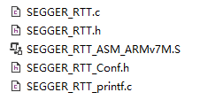
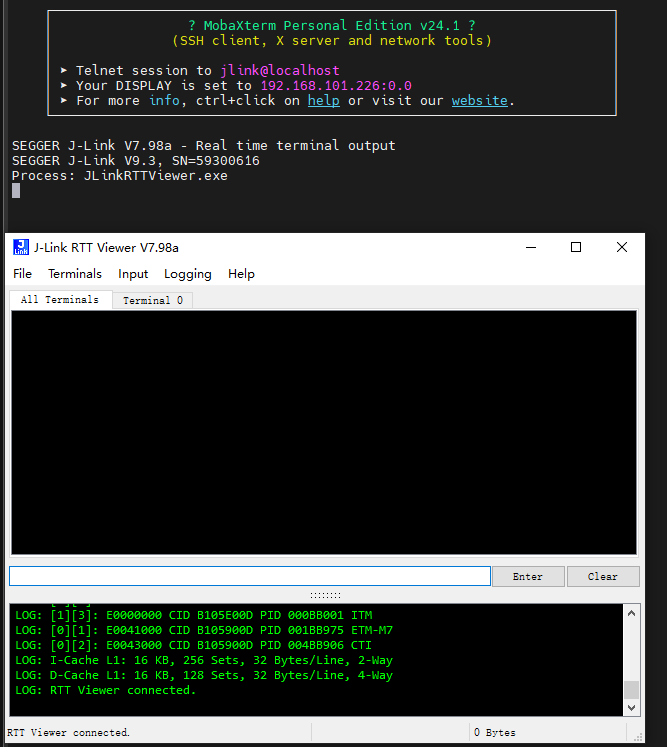
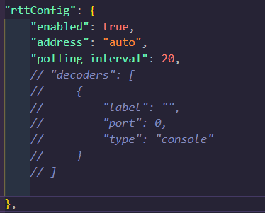
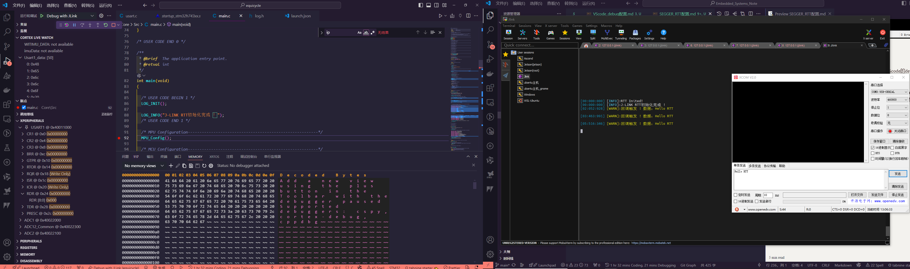
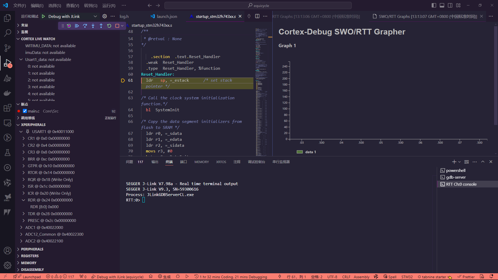

# SEGGER RTT 配置

- [SEGGER RTT 配置](#segger-rtt-配置)
  - [1 说明](#1-说明)
  - [2 移植前提](#2-移植前提)
  - [3 移植步骤](#3-移植步骤)
    - [3.1 将 RTT 目录文件移植进入源码目录](#31-将-rtt-目录文件移植进入源码目录)
    - [3.2 定义 LOG.H 文件方便调用 SEGGER\_API 接口](#32-定义-logh-文件方便调用-segger_api-接口)
    - [3.3 在程序中调用接口](#33-在程序中调用接口)
  - [4 开启 RTT 配置](#4-开启-rtt-配置)
  - [5 启动 RTT](#5-启动-rtt)
    - [5.1 使用 J-Link RTT Viewer](#51-使用-j-link-rtt-viewer)
    - [5.2 使用 VScode Debug(推荐)](#52-使用-vscode-debug推荐)
  - [6 额外功能](#6-额外功能)

## 1 说明

SEGGER 是由于串口，SWO 调试的方法，而且不占用串口资源，实时性很高

参考:[https://wiki.segger.com/RTT]

## 2 移植前提

1. J-Link 驱动

## 3 移植步骤

### 3.1 将 RTT 目录文件移植进入源码目录

RTT 目录往往在：~\JLink_V798a\Samples\RTT\SEGGER_RTT_V798a\RTT


直接将整个 RTT 文件夹拖入工程即可

**注意修改 CmakeLists.txt 文件**

### 3.2 定义 LOG.H 文件方便调用 SEGGER_API 接口

SEGGER 官方提供的接口较为繁琐，所以往往可以使用 LOG.H 宏定义一边接口，并且重定向到 printf

我将给出我常用的 LOG.H 文件，方便调用

**常规简易 LOG.H**

```c
#ifndef LOG_H
#define LOG_H

#include "SEGGER_RTT.h"

// 日志级别定义
#define LOG_LEVEL_NOLOG 0 // 无日志输出
#define LOG_LEVEL_ERROR 1 // 只输出错误
#define LOG_LEVEL_WARN 2  // 输出警告和错误
#define LOG_LEVEL_INFO 3  // 输出信息、警告和错误
#define LOG_LEVEL_DEBUG 4 // 输出调试信息、信息、警告和错误

// 设置当前日志级别
#define LOG_LEVEL LOG_LEVEL_DEBUG

// 常用文本颜色控制宏
#define LOG_RESET RTT_CTRL_RESET
#define LOG_RED RTT_CTRL_TEXT_RED
#define LOG_GREEN RTT_CTRL_TEXT_GREEN
#define LOG_YELLOW RTT_CTRL_TEXT_YELLOW
#define LOG_BLUE RTT_CTRL_TEXT_BLUE
#define LOG_MAGENTA RTT_CTRL_TEXT_MAGENTA
#define LOG_CYAN RTT_CTRL_TEXT_CYAN
#define LOG_WHITE RTT_CTRL_TEXT_WHITE

// 日志输出宏定义
#if LOG_LEVEL >= LOG_LEVEL_DEBUG
#define LOG(fmt, ...) SEGGER_RTT_printf(0, LOG_RESET "[DEBUG]: " fmt "\r\n", ##__VA_ARGS__)
#else
#define LOG(fmt, ...)
#endif

#if LOG_LEVEL >= LOG_LEVEL_INFO
#define LOG_INFO(fmt, ...) SEGGER_RTT_printf(0, LOG_GREEN "[INFO]: " fmt "\r\n", ##__VA_ARGS__)
#else
#define LOG_INFO(fmt, ...)
#endif

#if LOG_LEVEL >= LOG_LEVEL_WARN
#define LOG_WARN(fmt, ...) SEGGER_RTT_printf(0, LOG_YELLOW "[WARN]: " fmt "\r\n", ##__VA_ARGS__)
#else
#define LOG_WARN(fmt, ...)
#endif

#if LOG_LEVEL >= LOG_LEVEL_ERROR
#define LOG_ERROR(fmt, ...) SEGGER_RTT_printf(0, LOG_RED "[ERROR]: " fmt "\r\n", ##__VA_ARGS__)
#else
#define LOG_ERROR(fmt, ...)
#endif

#endif // LOG_H
```

**带有时间戳的 LOG.H 文件**，==注意需要定义时间源!==

```c

#ifndef LOG_H
#define LOG_H
#include "SEGGER_RTT.h"
#if defined(USE_HAL_DRIVER)
extern uint32_t HAL_GetTick(void);
extern uint32_t HAL_GetUs(void);
    #define SYS_MS HAL_GetTick()
    #define SYS_US HAL_GetUs()
#else
    #define SYS_MS 0  // 如果不是使用HAL库 则使用自定义的时间源
    #define SYS_US 0
#endif

#define USE_LOG_DEBUG   1
#define PRINT_TIMESTAMP 1

typedef enum {
    LOG_TERMINAL0,
    LOG_TERMINAL1,
    LOG_TERMINAL2,
    LOG_TERMINAL3,
    LOG_TERMINAL4,
    LOG_TERMINAL5,
} LogTerminal_e;

typedef enum {
    LOG_ARR_BYTE1,
    LOG_ARR_BYTE2,
    LOG_ARR_BYTE4,
    LOG_ARR_FLOAT,
    LOG_ARR_INT,
} LogArrayType_e;

#if USE_LOG_DEBUG
    #if PRINT_TIMESTAMP
        #define LOG_PROTO(type, color, format, ...)                                                                                        \
            SEGGER_RTT_printf(0, "[%02d:%03d:%03d] %s%s" format "%s\r\n", (SYS_MS / 1000) % 60, SYS_MS % 1000, SYS_US % 1000, color, type, \
                              ##__VA_ARGS__, RTT_CTRL_RESET);
        // #define LOG_PROTO(type, color, format, ...)                                                                                                \
        //     SEGGER_RTT_printf(0, "[%02d:%02d:%02d:%03d:%03d] %s%s" format "%s\r\n", (SYS_MS / (60 * 60 * 1000)) % 24, (SYS_MS / (60 * 1000)) % 60, \
        //                       (SYS_MS / 1000) % 60, SYS_MS % 1000, SYS_US % 1000, color, type, ##__VA_ARGS__, RTT_CTRL_RESET);
    #else
        #define LOG_PROTO(type, color, format, ...) SEGGER_RTT_printf(0, "%s%s" format "%s\r\n", color, type, ##__VA_ARGS__, RTT_CTRL_RESET);
    #endif

    #define LOG_INFO(format, ...)  LOG_PROTO("[INFO]:", "", format, ##__VA_ARGS__)                           // 无颜色日志输出
    #define LOG_DEBUG(format, ...) LOG_PROTO("[DEBUG]:", RTT_CTRL_TEXT_BRIGHT_GREEN, format, ##__VA_ARGS__)  // 绿色日志输出
    #define LOG_WARN(format, ...)  LOG_PROTO("[WARN]:", RTT_CTRL_TEXT_BRIGHT_YELLOW, format, ##__VA_ARGS__)  // 黄色日志输出
    #define LOG_ERROR(format, ...) LOG_PROTO("[ERROR]:", RTT_CTRL_TEXT_BRIGHT_RED, format, ##__VA_ARGS__)    // 红色日志输出
    #define LOG_CLEAR()            SEGGER_RTT_WriteString(0, "\r\n" RTT_CTRL_CLEAR)                          // 清屏

    // 打印数组
    #define LOG_ARRAY(pArr, len, logArrayType, terminal)                        \
        do {                                                                    \
            SEGGER_RTT_SetTerminal(terminal);                                   \
            for (int i = 0; i < len; i++) {                                     \
                switch (logArrayType) {                                         \
                    case LOG_ARR_BYTE1:                                         \
                        SEGGER_RTT_printf(0, "%02x ", *(uint8_t *)(pArr + i));  \
                        break;                                                  \
                    case LOG_ARR_BYTE2:                                         \
                        SEGGER_RTT_printf(0, "%04x ", *(uint16_t *)(pArr + i)); \
                        break;                                                  \
                    case LOG_ARR_BYTE4:                                         \
                        SEGGER_RTT_printf(0, "%08x ", *(uint32_t *)(pArr + i)); \
                        break;                                                  \
                    case LOG_ARR_FLOAT:                                         \
                        SEGGER_RTT_printf(0, "%f ", *(float *)(pArr + i));      \
                        break;                                                  \
                    case LOG_ARR_INT:                                           \
                        SEGGER_RTT_printf(0, "%d ", *(int *)(pArr + i));        \
                        break;                                                  \
                    default:                                                    \
                        break;                                                  \
                }                                                               \
            }                                                                   \
            SEGGER_RTT_printf(0, "\r\n");                                       \
            SEGGER_RTT_SetTerminal(0);                                          \
        } while (0)

    // 初始化
    #define LOG_INIT()               \
        do {                         \
            SEGGER_RTT_Init();       \
            LOG_CLEAR();             \
            LOG_INFO("RTT Inited!"); \
        } while (0)

#else
    #define LOG_INFO(format, ...)
    #define LOG_DEBUG(format, ...)
    #define LOG_WARN(format, ...)
    #define LOG_ERROR(format, ...)
    #define LOG_CLEAR()
    #define LOG_ARRAY(pArr, len, logArrayType, terminal)
    #define LOG_INIT()
#endif

#endif

```

### 3.3 在程序中调用接口

只需要在程序中需要打印输出 debug 信息的地方调用 LOG.h 中的接口即可

## 4 开启 RTT 配置

这里我将以 VScode 为例子开启 RTT 调试，其他 IDE 也类似。

主要需要配置 launch.json 文件中开启 rttConfig

```json


            "rttConfig": {
                "enabled": true,
                "address": "auto",
                "polling_interval": 20,
                "decoders": [
                    {
                        "label": "",
                        "port": 0,
                        "type": "console"
                    }
                ]

            }
```

此时运行 debug 会直接 decoders 出一个 RTT 终端，并且在终端中显示信息

## 5 启动 RTT

启动方式有如下方式

1. J-Link RTT Viewer
2. VScode Debug(运行和调试)

### 5.1 使用 J-Link RTT Viewer

使用 J-Link RTT Viewer 时候无需启动 VScode 的 debuger，程序会自动开始调试，并且 RTT 信息可以直接回传，同时也可以映射会诸如 Xshell，MobaXterm 的调试终端



### 5.2 使用 VScode Debug(推荐)

这种方式不需要额外借助 J-Link RTT Viewer，直接在 VScode 的 debugger 中开启 RTT，并且可以映射到 Xshell，MobaXterm 的调试终端

**注意使用 MobaXterm 时，需要将 RTT 的输出重定向到 MobaXterm 的终端，否则 RTT 的输出会直接打印到 VScode 的终端中，导致无法正常显示 RTT 的输出**

具体方法是注释掉 decoders。





这种方式满足了我们对 RTT 的所有功能需求

1. 运行和调试
2. 返回时间戳
3. 输出到 Xshell，MobaXterm 的调试终端
4. 彩色日志

## 6 额外功能

RTT/SWO 还支持图像化界面调试，具体配置可以参考[SWO Output - Marus/cortex-debug GitHub Wiki Basic SWO Output Configuration](https://github-wiki-see.page/m/Marus/cortex-debug/wiki/SWO-Output)

这里只做界面展示：

