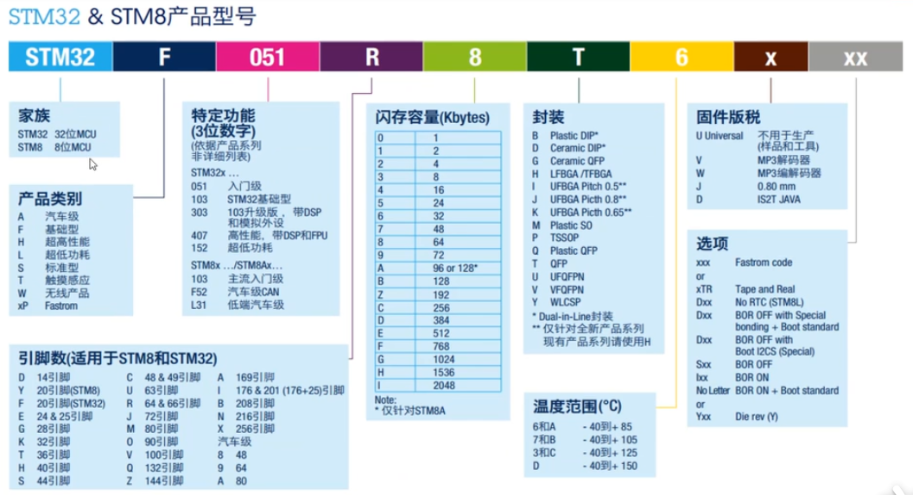
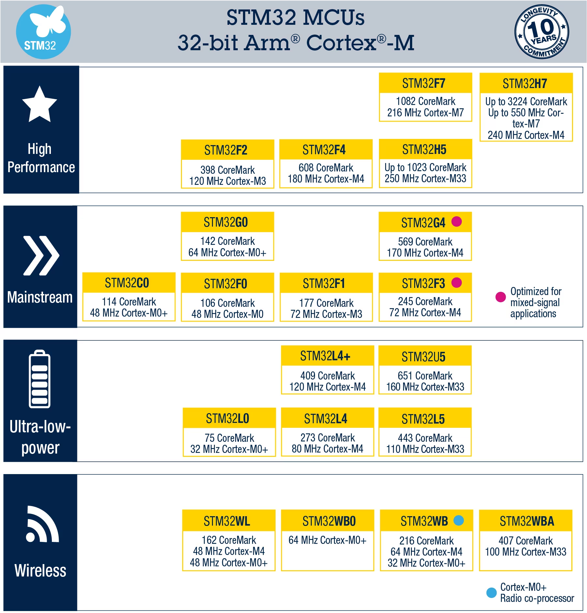
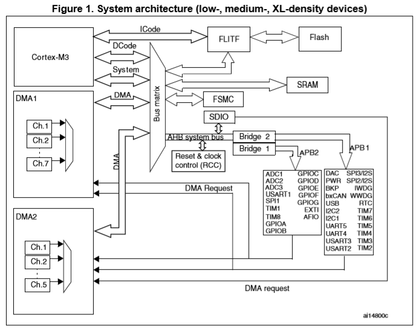

# STM32结构框图

## 0 STM32家族

## 1 STM32系统框图

### 1.1 Cortex-M3内核

它是STM32F103的内核，也就是CPU，相当于元帅。除掉他，其他部件都是片上外设，注意是片上的，也就是那块我们肉眼所见的芯片里的外设。这位元帅足不出户，便可操纵队列，依靠的是自己强大的数字运算能力和强大的总线设计。在阵列中，数据的运算都呈报给元帅来做。

### 1.2 Incode总线

阵列的运行需要有人下达指令，元帅Cortex-M3是命令的下发者，却并非命令的产生者。那么命令从何而来？在《三体》中，冯诺依曼在布阵前早已想好了指令。同样，各位STM32的热爱者才是聪慧的命令发起者——我们写好的程序被译成机器指令存储于Flash中。ICode总线就是一队骑兵，将指令一条条送达给元帅Cortex-M3。

### 1.3 Bus-Matrix

Bus-Matrix（总线矩阵）的功能是总线仲裁。类似于现在的快递站，假如没有快递站作为中转，一家快递公司的送货路线规划就变成了14亿条。在阵列中，方阵Bus-Matrix作为中介，减少了骑兵队的数量开销，增加了系统的简洁有序性，降低了信息传输的错误率。在图中，Bus-Matrix右侧安排了四支骑兵，他们送来的信息都被加以分类，而左侧的四支骑兵则可以从属于自己的类别中拿走信件，避免了错拿的情况。这就是Bus-Matrix的作用之处。

### 1.4 DCode总线

